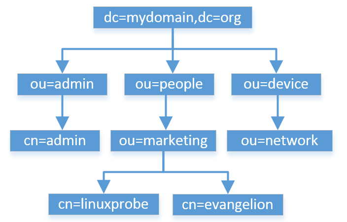

<!--
 * @Author: jangrui
 * @Date: 2019-07-31 07:48:58
 * @LastEditors: jangrui
 * @LastEditTime: 2019-08-30 02:44:40
 * @version: 
 * @Descripttion: LDAP 部署轻量级目录服务
 -->

# LDAP

一个为查询、浏览和搜索而优化的专业分布式数据库，它呈树状结构组织数据，和关系数据库不同，它有优异的读性能，但写性能差，并且没有事务处理、回滚等复杂功能，不适于存储修改频繁的数据，所以大多数是用来查询的。

LDAP 采用树状结构存储数据（类似于 DNS 服务程序），用于在IP 网络层面实现对分布式目录的访问和管理操作，条目是 LDAP 协议中最基本的元素，可以想象成字典中的单词或者数据库中的记录，通常对 LDAP 服务程序的添加、删除、更改、搜索都是以条目为基本对象的。



- `dn`: 每个条目的唯一标识符
- `dc`: 域名
- `ou`: 单位（部门）名称
- `cn`: 名字
- `sn`: 姓氏
- `o`: 组织（公司）名称
- `c`: 国家

> 每个条目可以有多个属性（如姓名、地址、电话等），每个属性中会保存着对象名称与对应值。

## 实验环境

|主机名称|ip 地址|操作系统|
|-|-|-|
|server.linuxprobe.com|192.168.10.10|CentOS 7|
|client.linuxprobe.com|192.168.10.20|CentOS 7|

## 服务端配置

OpenLDAP 是提供管理目录数据的服务的软件产品，多数场景用来做统一登录认证。

1. 安装 openldap 相关软件包

```bash
yum install -y openldap openldap-clients openldap-servers migrationtools
```

2. 生成秘钥文件

```bash
slappasswd -s linuxprobe -n > /etc/openldap/passwd
openldappasswd=`cat /etc/openldap/passwd`

echo $openldappasswd
echo "192.168.10.10 server.linuxprobe.com" >> /etc/hosts
```

3. TLS 加密数据传输

LDAP 服务默认以明文方式在网络中传输数据（包括密码）。

```bash
openssl req -new -x509 -nodes -out /etc/openldap/certs/cert.pem -keyout /etc/openldap/certs/priv.pem -days 365

ls -al /etc/openldap/certs/
chown -R ldap.ldap /etc/openldap/certs
chmod -R 600 /etc/openldap/certs/priv.pem
```

> 一路回车即可。

4. 生成数据库文件

```bash
cp /usr/share/openldap-servers/DB_CONFIG.example /var/lib/ldap/DB_CONFIG

slaptest

chown -R ldap.ldap /var/lib/ldap

systemctl restart slapd
```

5. 添加模块

在 LDAP 目录服务中使用 LDIF (LDAP Interchange Format)格式来保存信息，而 LDIF 是一种标准的文本文件且可以随意的导入导出，所以我们需要有一种“格式”标准化 LDIF 文件的写法，这中格式叫做“schema”。

schema 用于指定一个目录中所包含对象的类型，以及每一个类型中的可选属性，我们可以将 schema 理解为面向对象程序设计中的“类”，通过“类”定义出具体的对象，因此其实 LDIF 数据条目则都是通过 schema 数据模型创建出来的具体对象。

- `ldapadd`: 用于将 LDIF 文件导入目录服务数据库中。
  - `-x`: 进行简单认证。
  - `-D`: 用于绑定服务器的 dn。
  - `-h`: 指定目录服务器的地址。
  - `-w`: 绑定 dn 的密码。
  - `-f`: 指定 ldif 文件进行条目添加的文件。

添加 cosine 和 nis 模块：

```bash
ldapadd -Y EXTERNAL -H ldapi:/// -D "cn=config" -f /etc/openldap/schema/cosine.ldif

cat <<EOF> /etc/openldap/changes.ldif
dn: olcDatabase={2}hdb,cn=config
changetype: modify
replace: olcSuffix
olcSuffix: dc=linuxprobe,dc=com

dn: olcDatabase={2}hdb,cn=config
changetype:modify
replace: olcRootDN
olcRootDN: cn=Manager,dc=linuxprobe,dc=com

dn: olcDatabase={2}hdb,cn=config
changetype: modify
replace: olcRootPW
olcRootPW: $openldappasswd

dn: cn=config
changetype: modify
replace: olcTLSCertificateFile
olcTLSCertificateFile: /etc/openldap/certs/cert.pem

dn: cn=config
changetype: modify
replace: olcTLSCertificateKeyFile
olcTLSCertificateKeyFile: /etc/openldap/certs/priv.pem

dn: cn=config
changetype: modify
replace: olcLogLevel
olcLogLevel: -1

dn: olcDatabase={1}monitor,cn=config
changetype: modify
replace: olcAccess
olcAccess: {0}to * by dn.base="gidNumber=0+uidNumber=0,cn=peercred,cn=external,cn=auth" read by dn.base="cn=Manager,dc=linuxprobe,dc=com" read by * none
EOF

ldapmodify -Y EXTERNAL -H ldapi:/// -f /etc/openldap/changes.ldif
```

1. 初始化 openldap 服务管理权限

```bash
slappasswd -s linuxprobe -n /etc/openldap/passwd
openldappasswd=`cat /etc/openldap/passwd`

sed -i 's/dc=my-domain,dc=com/dc=linuxprobe,dc=com,dc=cn/g'  /etc/openldap/slapd.d/cn\=config/olcDatabase\=\{2\}hdb.ldif
sed -i "/olcRootDN/a\oclRootPW: $openldappasswd" /etc/openldap/slapd.d/cn\=config/olcDatabase\=\{2\}hdb.ldif

slaptest -u
```

2. 配置 Openldap 数据库

```bash
cp /usr/share/openldap-servers/DB_CONFIG.example /var/lib/ldap/DB_CONFIG

chown ldap.ldap -R /var/lib/ldap/
chmod 700 -R /var/lib/ldap/
ls -al /var/lib/ldap/

ldapadd -Y EXTERNAL -H ldapi:/// -f /etc/openldap/schema/cosine.ldif

ldapadd -Y EXTERNAL -H ldapi:/// -f /etc/openldap/schema/nis.ldif

ldapadd -Y EXTERNAL -H ldapi:/// -f /etc/openldap/schema/inetorgperson.ldif
```

3. 初始化组织架构及添加初始用户和组

```bash
sed -i 's,$DEFAULT_MAIL_DOMAIN =.*,$DEFAULT_MAIL_DOMAIN = "linuxprobe.com";,' /usr/share/migrationtools/migrate_common.ph

sed -i 's,$DEFAULT_BASE =.*,$DEFAULT_BASE = "dc=linuxprobe\,dc=com";,' /usr/share/migrationtools/migrate_common.ph

sed -i 's,$EXTENDED_SCHEMA =.*,$EXTENDED_SCHEMA = 1;,' /usr/share/migrationtools/migrate_common.ph

groupadd OPS
groupadd HR
useradd -g OPS charles
useradd -g HR fiona
echo "123456" | passwd --stdin charles
echo "123456" | passwd --stdin fiona
grep "OPS" /etc/group > groups
grep "HR" /etc/group >> groups
grep "charles" /etc/passwd > users
grep "fiona" /etc/passwd >> users
/usr/share/migrationtools/migrate_passwd.pl users > users.ldif
/usr/share/migrationtools/migrate_group.pl groups > groups.ldif

cat <<EOF> base.ldif
dn: dc=linuxprobe,dc=com
o: linuxprobe.com
dc: linuxprobe
objectClass: top
objectClass: domain

dn: ou=People,dc=linuxprobe,dc=com
ou: People
objectClass: top
objectClass: organizationalUnit

dn: ou=Group,dc=linuxprobe,dc=com
ou: Group
objectClass: top
objectClass: organizationalUnit
EOF

ldapadd -x -w "linuxprobe" -D "cn=Manager,dc=linuxprobe,dc=com" -f base.ldif

ldapadd -x -w "linuxprobe" -D cn=Manager,dc=linuxprobe,dc=com -f users.ldif

ldapadd -x -w "linuxprobe" -D cn=Manager,dc=linuxprobe,dc=com -f groups.ldif
```
