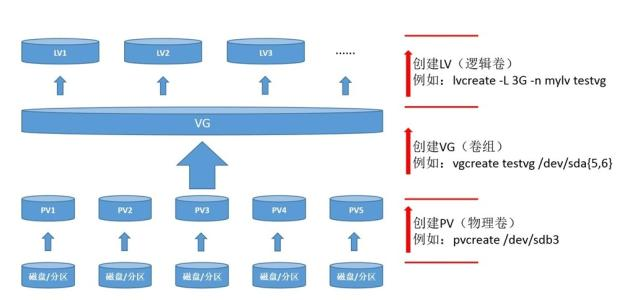

<!--
 * @Author: jangrui
 * @Date: 2019-07-31 07:44:38
 * @LastEditors: jangrui
 * @LastEditTime: 2019-08-26 20:14:25
 * @version: 
 * @Descripttion: 
 -->

# LVM 逻辑卷管理器

LVM(Logical Volume Manager)逻辑卷管理是在Linux 2.4 内核以上实现的磁盘管理技术。它是 Linux 环境下对磁盘分区进行管理的一种机制。

当遇到某个分区空间耗尽时，解决的方法通常是使用符号链接，或者使用调整分区大小的工具，但这只是暂时解决办法，没有从根本上解决问题。随着Linux 的逻辑卷管理功能的出现，这些问题都迎刃而解，用户在无需停机的情况下可以方便地调整各个分区大小。

LVM 技术是在硬盘分区和文件系统之间添加了一个逻辑层，它提供了一个抽象的卷组，可以把多块硬盘进行卷组合并。用户不必关心物理硬盘设备的底层架构和布局，可以实现对硬盘分区的动态调整。



- 命令

|功能|物理卷 PV |卷组 VG   |逻辑卷 LV |
|-|-|-|-|
|扫描|pvscan   |vgscan   |lvscan   |
|创建|pvcreate |vgcreate |lvcreate |
|查看|pvdisplay|vgdisplay|lvdisplay|
|删除|pvremove |vgremove |lvremove |
|扩展|         |vgextend |lvextend |
|缩小|         |vgreduce |lvreduce |

## 创建物理卷

准备几块磁盘

```bash
[root@localhost ~]# ll /dev/sd*
brw-rw----. 1 root disk 8,  0 7月  31 06:52 /dev/sda
brw-rw----. 1 root disk 8,  1 7月  31 06:52 /dev/sda1
brw-rw----. 1 root disk 8,  2 7月  31 06:52 /dev/sda2
brw-rw----. 1 root disk 8, 16 7月  31 07:41 /dev/sdb
brw-rw----. 1 root disk 8, 32 7月  31 07:41 /dev/sdc
```

让 `/dev/sdb`、`/dev/sdc` 支持 LVM

```bash
[root@localhost ~]# pvcreate /dev/sdb /dev/sdc
  Physical volume "/dev/sdb" successfully created.
  Physical volume "/dev/sdc" successfully created.
[root@localhost ~]#
```

## 创建卷组

创建一个卷组，并把 `/dev/sdb`、`/dev/sdc` 加入到卷组

```bash
[root@localhost ~]# vgcreate vg1 /dev/sdb /dev/sdc
  Volume group "vg1" successfully created
[root@localhost ~]# vgs
  VG     #PV #LV #SN Attr   VSize  VFree
  centos   1   2   0 wz--n- <9.00g    0
  vg1      2   0   0 wz--n-  9.99g 9.99g
[root@localhost ~]# vgdisplay
  --- Volume group ---
  VG Name               vg1
  System ID
  Format                lvm2
  Metadata Areas        2
  Metadata Sequence No  1
  VG Access             read/write
  VG Status             resizable
  MAX LV                0
  Cur LV                0
  Open LV               0
  Max PV                0
  Cur PV                2
  Act PV                2
  VG Size               9.99 GiB
  PE Size               4.00 MiB
  Total PE              2558
  Alloc PE / Size       0 / 0
  Free  PE / Size       2558 / 9.99 GiB
  VG UUID               LESM13-wmSU-sTAN-RFi3-qbsn-WEdg-LSay6x

  --- Volume group ---
  VG Name               centos
  System ID
  Format                lvm2
  Metadata Areas        1
  Metadata Sequence No  3
  VG Access             read/write
  VG Status             resizable
  MAX LV                0
  Cur LV                2
  Open LV               2
  Max PV                0
  Cur PV                1
  Act PV                1
  VG Size               <9.00 GiB
  PE Size               4.00 MiB
  Total PE              2303
  Alloc PE / Size       2303 / <9.00 GiB
  Free  PE / Size       0 / 0
  VG UUID               13hZJW-bqaq-SWSX-dA7U-xjT3-AiBE-4jwgDt

[root@localhost ~]#
```

- PE 大小调整

PE 默认大小 4m

1. 创建卷组时调整默认 PE 大小: `vgcreate -s 16m vg1 /dev/sdb /dev/sdc`
2. vgchange 命令调整: `vgchange vg1 -s 4m`

## 切割逻辑卷

在对逻辑卷进行切割时有两种计量单位。

第一种是以容量为单位，所使用的参数为-L。例如，使用-L 150M生成一个大小为150MB的逻辑卷。

```bash
[root@localhost ~]# lvs
  LV   VG     Attr       LSize  Pool Origin Data%  Meta%  Move Log Cpy%Sync Convert
  root centos -wi-ao---- <8.00g
  swap centos -wi-ao----  1.00g
[root@localhost ~]# lvcreate -n lv1 -L 300m vg1
  Logical volume "lv1" created.
[root@localhost ~]# lvs
  LV   VG     Attr       LSize   Pool Origin Data%  Meta%  Move Log Cpy%Sync Convert
  root centos -wi-ao----  <8.00g
  swap centos -wi-ao----   1.00g
  lv1  vg1    -wi-a----- 300.00m
[root@localhost ~]# lvdisplay vg1/lv1
  --- Logical volume ---
  LV Path                /dev/vg1/lv1
  LV Name                lv1
  VG Name                vg1
  LV UUID                PYFQkX-MBIr-Edd2-aeJu-QSkk-c56U-3NMR1v
  LV Write Access        read/write
  LV Creation host, time localhost.localdomain, 2019-08-01 07:59:01 +0800
  LV Status              available
  # open                 0
  LV Size                300.00 MiB
  Current LE             75
  Segments               1
  Allocation             inherit
  Read ahead sectors     auto
  - currently set to     8192
  Block device           253:2

[root@localhost ~]#
```

另外一种是以基本单元的个数为单位，所使用的参数为-l。每个基本单元的大小默认为4MB。例如，使用-l 37可以生成一个大小为37×4MB=148MB的逻辑卷。

```bash
[root@localhost ~]# lvcreate -n lv2 -l 37 vg1
  Logical volume "lv2" created.
[root@localhost ~]# lvs
  LV   VG     Attr       LSize   Pool Origin Data%  Meta%  Move Log Cpy%Sync Convert
  root centos -wi-ao----  <8.00g
  swap centos -wi-ao----   1.00g
  lv1  vg1    -wi-a----- 148.00m
  lv2  vg1    -wi-a----- 148.00m
[root@localhost ~]# lvdisplay /dev/vg1/lv
/dev/vg1/lv1  /dev/vg1/lv2
[root@localhost ~]# lvdisplay /dev/vg1/lv2
  --- Logical volume ---
  LV Path                /dev/vg1/lv2
  LV Name                lv2
  VG Name                vg1
  LV UUID                QbKDQ8-ieSy-ThbL-Z2YI-K23k-hm77-ZdEaWb
  LV Write Access        read/write
  LV Creation host, time localhost.localdomain, 2019-08-01 07:55:52 +0800
  LV Status              available
  # open                 0
  LV Size                148.00 MiB
  Current LE             37
  Segments               1
  Allocation             inherit
  Read ahead sectors     auto
  - currently set to     8192
  Block device           253:3

[root@localhost ~]#
```

## 格式化逻辑卷

```bash
[root@localhost ~]# mkfs.xfs /dev/vg1/lv1
meta-data=/dev/vg1/lv1           isize=512    agcount=4, agsize=19200 blks
         =                       sectsz=512   attr=2, projid32bit=1
         =                       crc=1        finobt=0, sparse=0
data     =                       bsize=4096   blocks=76800, imaxpct=25
         =                       sunit=0      swidth=0 blks
naming   =version 2              bsize=4096   ascii-ci=0 ftype=1
log      =internal log           bsize=4096   blocks=855, version=2
         =                       sectsz=512   sunit=0 blks, lazy-count=1
realtime =none                   extsz=4096   blocks=0, rtextents=0
[root@localhost ~]# mkdir /test1
[root@localhost ~]# cat <<end>> /etc/fstab
> /dev/vg1/lv1 /test1 xfs defaults 0 0
> end
[root@localhost ~]# cat /etc/fstab
#
# /etc/fstab
# Created by anaconda on Wed Jun 12 21:56:17 2019
#
# Accessible filesystems, by reference, are maintained under '/dev/disk'
# See man pages fstab(5), findfs(8), mount(8) and/or blkid(8) for more info
#
/dev/mapper/centos-root /                       xfs     defaults        0 0
UUID=b9d39bf8-743f-4a01-b856-33688690ada4 /boot                   xfs     defaults        0 0
/dev/mapper/centos-swap swap                    swap    defaults        0 0
/dev/vg1/lv1 /test1 xfs defaults 0 0
[root@localhost ~]# mount -a
[root@localhost ~]# df -h
文件系统                 容量  已用  可用 已用% 挂载点
/dev/mapper/centos-root  8.0G  2.0G  6.1G   24% /
devtmpfs                 475M     0  475M    0% /dev
tmpfs                    487M     0  487M    0% /dev/shm
tmpfs                    487M  7.5M  479M    2% /run
tmpfs                    487M     0  487M    0% /sys/fs/cgroup
/dev/sda1               1014M  194M  821M   20% /boot
tmpfs                     98M     0   98M    0% /run/user/0
/dev/mapper/vg1-lv1      297M   16M  282M    6% /test1
[root@localhost ~]#
```

## 扩容逻辑卷

- xfs 格式

```bash
[root@localhost ~]# vgdisplay vg1
  --- Volume group ---
  VG Name               vg1
  System ID
  Format                lvm2
  Metadata Areas        2
  Metadata Sequence No  6
  VG Access             read/write
  VG Status             resizable
  MAX LV                0
  Cur LV                1
  Open LV               1
  Max PV                0
  Cur PV                2
  Act PV                2
  VG Size               9.99 GiB
  PE Size               4.00 MiB
  Total PE              2558
  Alloc PE / Size       75 / 300.00 MiB
  Free  PE / Size       2483 / <9.70 GiB
  VG UUID               o1xUxv-U8yj-EDEw-YYz8-PTSl-XfmW-w0CMe5

[root@localhost ~]# lvextend -L 500m /dev/vg1/lv1
  Size of logical volume vg1/lv1 changed from 300.00 MiB (75 extents) to 500.00 MiB (125 extents).
  Logical volume vg1/lv1 successfully resized.
[root@localhost ~]# xfs_growfs /dev/vg1/lv1
meta-data=/dev/mapper/vg1-lv1    isize=512    agcount=4, agsize=19200 blks
         =                       sectsz=512   attr=2, projid32bit=1
         =                       crc=1        finobt=0 spinodes=0
data     =                       bsize=4096   blocks=76800, imaxpct=25
         =                       sunit=0      swidth=0 blks
naming   =version 2              bsize=4096   ascii-ci=0 ftype=1
log      =internal               bsize=4096   blocks=855, version=2
         =                       sectsz=512   sunit=0 blks, lazy-count=1
realtime =none                   extsz=4096   blocks=0, rtextents=0
data blocks changed from 76800 to 128000
[root@localhost ~]# df -h
文件系统                 容量  已用  可用 已用% 挂载点
/dev/mapper/centos-root  8.0G  2.0G  6.1G   24% /
devtmpfs                 475M     0  475M    0% /dev
tmpfs                    487M     0  487M    0% /dev/shm
tmpfs                    487M  7.5M  479M    2% /run
tmpfs                    487M     0  487M    0% /sys/fs/cgroup
/dev/sda1               1014M  194M  821M   20% /boot
tmpfs                     98M     0   98M    0% /run/user/0
/dev/mapper/vg1-lv1      497M   16M  482M    4% /test1
[root@localhost ~]#
```

- ext* 格式

```bash
[root@localhost ~]# lvs
  LV   VG     Attr       LSize   Pool Origin Data%  Meta%  Move Log Cpy%Sync Convert
  root centos -wi-ao----  <8.00g
  swap centos -wi-ao----   1.00g
  lv1  vg1    -wi-ao---- 500.00m
  lv2  vg1    -wi-a----- 148.00m
[root@localhost ~]# mkfs.ext4 /dev/vg1/lv2
mke2fs 1.42.9 (28-Dec-2013)
文件系统标签=
OS type: Linux
块大小=1024 (log=0)
分块大小=1024 (log=0)
Stride=0 blocks, Stripe width=0 blocks
38000 inodes, 151552 blocks
7577 blocks (5.00%) reserved for the super user
第一个数据块=1
Maximum filesystem blocks=33816576
19 block groups
8192 blocks per group, 8192 fragments per group
2000 inodes per group
Superblock backups stored on blocks:
    8193, 24577, 40961, 57345, 73729

Allocating group tables: 完成
正在写入inode表: 完成
Creating journal (4096 blocks): 完成
Writing superblocks and filesystem accounting information: 完成

[root@localhost ~]# mkdir /test2
[root@localhost ~]# cat <<end>> /etc/fstab
> /dev/vg1/lv2 /test2 ext4 defaults 0 0
> end
[root@localhost ~]# mount -a
[root@localhost ~]# df -h
文件系统                 容量  已用  可用 已用% 挂载点
/dev/mapper/centos-root  8.0G  2.0G  6.1G   24% /
devtmpfs                 475M     0  475M    0% /dev
tmpfs                    487M     0  487M    0% /dev/shm
tmpfs                    487M  7.5M  479M    2% /run
tmpfs                    487M     0  487M    0% /sys/fs/cgroup
/dev/sda1               1014M  194M  821M   20% /boot
tmpfs                     98M     0   98M    0% /run/user/0
/dev/mapper/vg1-lv1      497M   16M  482M    4% /test1
/dev/mapper/vg1-lv2      140M  1.6M  128M    2% /test2
[root@localhost ~]# lvextend -L 300m vg1/lv2
  Size of logical volume vg1/lv2 changed from 148.00 MiB (37 extents) to 300.00 MiB (75 extents).
  Logical volume vg1/lv2 successfully resized.
[root@localhost ~]# resize2fs /dev/vg1/lv2
resize2fs 1.42.9 (28-Dec-2013)
Filesystem at /dev/vg1/lv2 is mounted on /test2; on-line resizing required
old_desc_blocks = 2, new_desc_blocks = 3
The filesystem on /dev/vg1/lv2 is now 307200 blocks long.

[root@localhost ~]# df -h
文件系统                 容量  已用  可用 已用% 挂载点
/dev/mapper/centos-root  8.0G  2.0G  6.1G   24% /
devtmpfs                 475M     0  475M    0% /dev
tmpfs                    487M     0  487M    0% /dev/shm
tmpfs                    487M  7.5M  479M    2% /run
tmpfs                    487M     0  487M    0% /sys/fs/cgroup
/dev/sda1               1014M  194M  821M   20% /boot
tmpfs                     98M     0   98M    0% /run/user/0
/dev/mapper/vg1-lv1      497M   16M  482M    4% /test1
/dev/mapper/vg1-lv2      287M  2.1M  269M    1% /test2
[root@localhost ~]#
```

## 缩容逻辑卷

缩容操作前记得先备份好数据，并卸载挂载点。

> xfs 格式 不支持缩容。

```bash
[root@localhost ~]# df -h
文件系统                 容量  已用  可用 已用% 挂载点
/dev/mapper/centos-root  8.0G  2.0G  6.1G   24% /
devtmpfs                 475M     0  475M    0% /dev
tmpfs                    487M     0  487M    0% /dev/shm
tmpfs                    487M  7.5M  479M    2% /run
tmpfs                    487M     0  487M    0% /sys/fs/cgroup
/dev/sda1               1014M  194M  821M   20% /boot
tmpfs                     98M     0   98M    0% /run/user/0
/dev/mapper/vg1-lv1      497M   16M  482M    4% /test1
/dev/mapper/vg1-lv2      287M  2.1M  269M    1% /test2
[root@localhost ~]# resize2fs /dev/vg1/lv2 100m
resize2fs 1.42.9 (28-Dec-2013)
Filesystem at /dev/vg1/lv2 is mounted on /test2; on-line resizing required
resize2fs: On-line shrinking not supported
[root@localhost ~]# df -h
文件系统                 容量  已用  可用 已用% 挂载点
/dev/mapper/centos-root  8.0G  2.0G  6.1G   24% /
devtmpfs                 475M     0  475M    0% /dev
tmpfs                    487M     0  487M    0% /dev/shm
tmpfs                    487M  7.5M  479M    2% /run
tmpfs                    487M     0  487M    0% /sys/fs/cgroup
/dev/sda1               1014M  194M  821M   20% /boot
tmpfs                     98M     0   98M    0% /run/user/0
/dev/mapper/vg1-lv1      497M   16M  482M    4% /test1
/dev/mapper/vg1-lv2      287M  2.1M  269M    1% /test2
[root@localhost ~]# umount /test2/
[root@localhost ~]# resize2fs /dev/vg1/lv2 100m
resize2fs 1.42.9 (28-Dec-2013)
请先运行 'e2fsck -f /dev/vg1/lv2'.

[root@localhost ~]# e2fsck -f .
./             ../            .bash_history  .bash_logout   .bash_profile  .bashrc        .cshrc         .pki/          .ssh/          .tcshrc        .viminfo
[root@localhost ~]# e2fsck -f /dev/vg1/lv2
e2fsck 1.42.9 (28-Dec-2013)
第一步: 检查inode,块,和大小
第二步: 检查目录结构
第3步: 检查目录连接性
Pass 4: Checking reference counts
第5步: 检查簇概要信息
/dev/vg1/lv2: 11/76000 files (0.0% non-contiguous), 15759/307200 blocks
[root@localhost ~]# resize2fs /dev/vg1/lv2 100m
resize2fs 1.42.9 (28-Dec-2013)
Resizing the filesystem on /dev/vg1/lv2 to 102400 (1k) blocks.
The filesystem on /dev/vg1/lv2 is now 102400 blocks long.

[root@localhost ~]# mount -a
[root@localhost ~]# df -h
文件系统                 容量  已用  可用 已用% 挂载点
/dev/mapper/centos-root  8.0G  2.0G  6.1G   24% /
devtmpfs                 475M     0  475M    0% /dev
tmpfs                    487M     0  487M    0% /dev/shm
tmpfs                    487M  7.5M  479M    2% /run
tmpfs                    487M     0  487M    0% /sys/fs/cgroup
/dev/sda1               1014M  194M  821M   20% /boot
tmpfs                     98M     0   98M    0% /run/user/0
/dev/mapper/vg1-lv1      497M   16M  482M    4% /test1
/dev/mapper/vg1-lv2       93M  1.6M   85M    2% /test2
[root@localhost ~]#
```

## 逻辑卷快照

LVM还具备有“快照卷”功能，该功能类似于虚拟机软件的还原时间点功能。

> 快照卷的容量必须等同于逻辑卷的容量；
>
> 所在卷组有足够容量；
>
> 快照卷仅一次有效，一旦执行还原操作后则会被立即自动删除。

- 创建快照

```bash
[root@localhost ~]# vgdisplay vg1
  --- Volume group ---
  VG Name               vg1
  System ID
  Format                lvm2
  Metadata Areas        2
  Metadata Sequence No  9
  VG Access             read/write
  VG Status             resizable
  MAX LV                0
  Cur LV                2
  Open LV               2
  Max PV                0
  Cur PV                2
  Act PV                2
  VG Size               9.99 GiB
  PE Size               4.00 MiB
  Total PE              2558
  Alloc PE / Size       200 / 800.00 MiB
  Free  PE / Size       2358 / 9.21 GiB
  VG UUID               o1xUxv-U8yj-EDEw-YYz8-PTSl-XfmW-w0CMe5

[root@localhost ~]# df -h
文件系统                 容量  已用  可用 已用% 挂载点
/dev/mapper/centos-root  8.0G  2.0G  6.1G   24% /
devtmpfs                 475M     0  475M    0% /dev
tmpfs                    487M     0  487M    0% /dev/shm
tmpfs                    487M  7.5M  479M    2% /run
tmpfs                    487M     0  487M    0% /sys/fs/cgroup
/dev/sda1               1014M  194M  821M   20% /boot
tmpfs                     98M     0   98M    0% /run/user/0
/dev/mapper/vg1-lv1      497M   16M  482M    4% /test1
/dev/mapper/vg1-lv2       93M  1.6M   85M    2% /test2
[root@localhost ~]# ll /test1
总用量 0
[root@localhost ~]# cat <<end> /test1/hello.txt
> hello test1
> ssssssssss
> ssssssssss
> ssssssssss
> hello test1
> end
[root@localhost ~]# ll /test1/
总用量 4
-rw-r--r--. 1 root root 57 8月   1 08:35 hello.txt
[root@localhost ~]# lvdisplay /dev/vg1/lv1
  --- Logical volume ---
  LV Path                /dev/vg1/lv1
  LV Name                lv1
  VG Name                vg1
  LV UUID                PYFQkX-MBIr-Edd2-aeJu-QSkk-c56U-3NMR1v
  LV Write Access        read/write
  LV Creation host, time localhost.localdomain, 2019-08-01 07:59:01 +0800
  LV Status              available
  # open                 1
  LV Size                500.00 MiB
  Current LE             125
  Segments               1
  Allocation             inherit
  Read ahead sectors     auto
  - currently set to     8192
  Block device           253:2

[root@localhost ~]# lvcreate -L 500m -s -n backup-lv1 /dev/vg1/lv1
  Logical volume "backup-lv1" created.
[root@localhost ~]# lvdisplay /dev/vg1/lv1
  --- Logical volume ---
  LV Path                /dev/vg1/lv1
  LV Name                lv1
  VG Name                vg1
  LV UUID                PYFQkX-MBIr-Edd2-aeJu-QSkk-c56U-3NMR1v
  LV Write Access        read/write
  LV Creation host, time localhost.localdomain, 2019-08-01 07:59:01 +0800
  LV snapshot status     source of
                         backup-lv1 [active]
  LV Status              available
  # open                 1
  LV Size                500.00 MiB
  Current LE             125
  Segments               1
  Allocation             inherit
  Read ahead sectors     auto
  - currently set to     8192
  Block device           253:2

[root@localhost ~]#
```

可以看到多了一组 LV snapshot status 信息。

在逻辑卷所挂载的目录中创建一个100MB的文件用于测试

```bash
[root@localhost ~]# dd if=/dev/zero of=/test1/file count=1 bs=100M
记录了1+0 的读入
记录了1+0 的写出
104857600字节(105 MB)已复制，0.0740664 秒，1.4 GB/秒
[root@localhost ~]# ll -h /test1
总用量 101M
-rw-r--r--. 1 root root 100M 8月   1 08:49 file
-rw-r--r--. 1 root root   57 8月   1 08:35 hello.txt
[root@localhost ~]#
```

- 快照回退

快照卷会被自动删除掉，并且刚刚在逻辑卷设备被执行快照操作后再创建出来的100MB的垃圾文件也被清除了。

```bash
[root@localhost ~]# lvconvert --merge /dev/vg1/backup-lv1
  Merging of volume vg1/backup-lv1 started.
  vg1/lv1: Merged: 4.43%
  vg1/lv1: Merged: 100.00%
[root@localhost ~]# ll /test1/
总用量 4
-rw-r--r--. 1 root root 57 8月   1 08:35 hello.txt
[root@localhost ~]#
```

## 删除逻辑卷

取消逻辑卷与目录的挂载关联，删除配置文件中永久生效的设备参数。

- 删除逻辑卷

```bash
[root@localhost ~]# umount /test1
[root@localhost ~]# lvremove /dev/vg1/lv1 -f
  Logical volume "lv1" successfully removed
[root@localhost ~]#
```

- 删除卷组

```bash
[root@localhost ~]# vgs
  VG     #PV #LV #SN Attr   VSize  VFree
  centos   1   2   0 wz--n- <9.00g    0
  vg1      2   0   0 wz--n-  9.99g 9.99g
[root@localhost ~]# vgremove vg1 -f
  Volume group "vg1" successfully removed
```

- 删除物理卷

```bash
[root@localhost ~]# pvs
  PV         VG     Fmt  Attr PSize  PFree
  /dev/sda2  centos lvm2 a--  <9.00g    0
  /dev/sdb          lvm2 ---   5.00g 5.00g
  /dev/sdc          lvm2 ---   5.00g 5.00g
[root@localhost ~]# pvremove /dev/sdb /dev/sdc
  Labels on physical volume "/dev/sdb" successfully wiped.
  Labels on physical volume "/dev/sdc" successfully wiped.
[root@localhost ~]#
```
