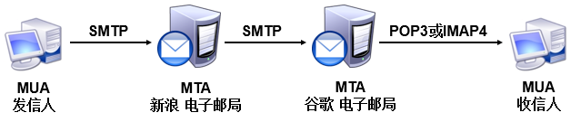
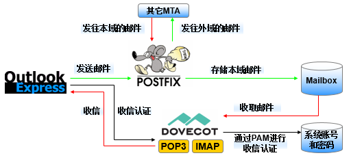

<!--
 * @Author: jangrui
 * @Date: 2019-07-31 07:47:41
 * @LastEditors: jangrui
 * @LastEditTime: 2019-08-23 07:14:57
 * @version: 
 * @Descripttion: Mail Server
 -->

# Mail Server

## Mail Server 与 DNS 之间的关系

### 合法的主机名

通常接收到的 email 都是使用`账号@主机名`的方式来处理的， 所以说，邮件服务器要有一个『合法注册过的主机名』。

在 DNS 查询系统当中`主机名`拥有一个 A 记录， 理论上 mail server 就可以架设成功。只不过由于目前互联网网上面的广告信、 垃圾信与病毒信等占用了太多的带宽，导致整个网络社会花费过多的成本在消耗这些垃圾资料。 所以为了杜绝可恶的垃圾信件，目前的大型网络供货商 (ISP) 都会针对不明来源的邮件加以限制。

### DNS 的 MX 标志

当一封邮件要传送出去时，邮件主机会先分析邮件的『目标主机的 DNS 』，先取得 MX 标志，然后以最优先 MX 主机为准将信发送出去。

> 注意，MX 标志可能会有多部主机。

MX 有啥好处啊？一般来说，如果目标主机宕机时，邮件通常会直接退还给原发信者， 但如果有 MX 主机时，这部 MX 主机会先将邮件放在队列 (queue) 当中，等到目标主机重新提供邮件服务后， MX 主机会将队列里的邮件传送给目标主机。

## 常见的邮件协议

- `SMTP`: 简单邮件传输协议（Simple Mail Transfer Protocol），用于发送和中转发出的电子邮件，占用服务器的25/TCP端口。

- `POP3`: 邮局协议版本3（Post Office Protocol 3），用于将电子邮件存储到本地主机，占用服务器的110/TCP端口。

- `IMAP`: Internet消息访问协议版本4（Internet Message Access Protocol 4），用于在本地主机上访问邮件，占用服务器的143/TCP端口。

在电子邮件系统中，为用户收发邮件的服务器名为邮件用户代理（Mail User Agent，MUA）。另外，既然电子邮件系统能够让用户在离线的情况下依然可以完成数据的接收，肯定得有一个用于保存用户邮件的“信箱”服务器，这个服务器的名字为邮件投递代理（Mail Delivery Agent，MDA），其工作职责是把来自于邮件传输代理（Mail Transfer Agent，MTA）的邮件保存到本地的收件箱中。其中，这个MTA的工作职责是转发处理不同电子邮件服务供应商之间的邮件，把来自于MUA的邮件转发到合适的MTA服务器。

例如，我们从新浪信箱向谷歌信箱发送一封电子邮件，这封电子邮件的传输过程如图所示。



## 部署 Mail Server

一个最基础的电子邮件系统肯定要能提供发件服务和收件服务，为此需要使用基于 SMTP 协议的 Postfix 服务程序提供发件服务功能，并使用基于 POP3 协议的 Dovecot 服务程序提供收件服务功能。电子邮件系统的工作流程如图所示。



### DNS 解析

```bash
yum install -y bind-chroot bind-utils
systemctl start bind
systemctl enable bind

firewall-cmd --permanent --add-service=dns
firewall-cmd --reload

sed -i -e 's,127.0.0.1;,any;,g' -e 's,localhost;,any;,g' -e 's,::1;,any;,g' /etc/named.conf
sed -i '/recursion yes/a\\tforwarders { 114.114.114.114; 8.8.8.8; };' /etc/named.conf

cat <<EOF> /etc/named.rfc1912.zones
zone "linuxprobe.com" IN {
    type master;
    file "linuxprobe.com.zone";
    allow-update { none; };
};
EOF

cat <<EOF> /var/named/linuxprobe.com.zone
\$TTL 1D
@       IN SOA  linuxprobe.com. root.linuxprobe.com (0 1D 1H 1W 3H);
        NS      ns.linuxprobe.com.
ns      A       192.168.10.10
@       MX 10   mail.linuxprobe.com.
mail    A       192.168.10.10
EOF

nmcli con show
nmcli con mod ens32 ipv4.dns 192.168.10.10
nmcli con up ens32

systemctl restart named

nslookup mail.linuxprobe.com
```

### 部署 Postfix

1. 安装 Postfix。

```bash
yum install -y postfix

systemctl start postfix
systemctl enable postfix

firewall-cmd --permanent --add-service=smtp --add-service=smtps
firewall-cmd --reload
```

> Postfix 服务程序主配置文件

```bash
cp /etc/postfix/main.cf /etc/postfix/main.cf.bak
cat /etc/postfix/main.cf
```

```bash
#soft_bounce = no
queue_directory = /var/spool/postfix
command_directory = /usr/sbin
daemon_directory = /usr/libexec/postfix
data_directory = /var/lib/postfix
mail_owner = postfix
#default_privs = nobody
#myhostname = host.domain.tld
#myhostname = virtual.domain.tld
# 邮局系统的主机名
#mydomain = domain.tld
# 邮局系统的域名
#myorigin = $myhostname
#myorigin = $mydomain
# 从本机发出邮件的域名名称
#inet_interfaces = all
#inet_interfaces = $myhostname
#inet_interfaces = $myhostname, localhost
inet_interfaces = localhost
# 监听的网卡接口
inet_protocols = all
#proxy_interfaces =
#proxy_interfaces = 1.2.3.4
mydestination = $myhostname, localhost.$mydomain, localhost
#mydestination = $myhostname, localhost.$mydomain, localhost, $mydomain
#mydestination = $myhostname, localhost.$mydomain, localhost, $mydomain, mail.$mydomain, www.$mydomain, ftp.$mydomain
# 可接收邮件的主机名或域名
#local_recipient_maps = unix:passwd.byname $alias_maps
#local_recipient_maps = proxy:unix:passwd.byname $alias_maps
#local_recipient_maps =
unknown_local_recipient_reject_code = 550
#mynetworks_style = class
#mynetworks_style = subnet
#mynetworks_style = host
# 设置可转发哪些主机的邮件
#relay_domains = $mydestination
# 设置可转发哪些网域的邮件
#relayhost = $mydomain
#relayhost = [gateway.my.domain]
#relayhost = [mailserver.isp.tld]
#relayhost = uucphost
#relayhost = [an.ip.add.ress]
#relay_recipient_maps = hash:/etc/postfix/relay_recipients
#in_flow_delay = 1s
#alias_maps = dbm:/etc/aliases
alias_maps = hash:/etc/aliases
#alias_maps = hash:/etc/aliases, nis:mail.aliases
#alias_maps = netinfo:/aliases
#alias_database = dbm:/etc/aliases
#alias_database = dbm:/etc/mail/aliases
alias_database = hash:/etc/aliases
#alias_database = hash:/etc/aliases, hash:/opt/majordomo/aliases
#recipient_delimiter = +
#home_mailbox = Mailbox
#home_mailbox = Maildir/
#mail_spool_directory = /var/mail
#mail_spool_directory = /var/spool/mail
#mailbox_command = /some/where/procmail
#mailbox_command = /some/where/procmail -a "$EXTENSION"
#mailbox_transport = lmtp:unix:/var/lib/imap/socket/lmtp
#mailbox_transport = cyrus
#fallback_transport = lmtp:unix:/var/lib/imap/socket/lmtp
#fallback_transport =
#luser_relay = $user@other.host
#luser_relay = $local@other.host
#luser_relay = admin+$local
#header_checks = regexp:/etc/postfix/header_checks
#fast_flush_domains = $relay_domains
#smtpd_banner = $myhostname ESMTP $mail_name
#smtpd_banner = $myhostname ESMTP $mail_name ($mail_version)
#local_destination_concurrency_limit = 2
#default_destination_concurrency_limit = 20
debug_peer_level = 2
#debug_peer_list = 127.0.0.1
#debug_peer_list = some.domain
debugger_command =
	 PATH=/bin:/usr/bin:/usr/local/bin:/usr/X11R6/bin
	 ddd $daemon_directory/$process_name $process_id & sleep 5
sendmail_path = /usr/sbin/sendmail.postfix
newaliases_path = /usr/bin/newaliases.postfix
mailq_path = /usr/bin/mailq.postfix
setgid_group = postdrop
html_directory = no
manpage_directory = /usr/share/man
sample_directory = /usr/share/doc/postfix-2.10.1/samples
readme_directory = /usr/share/doc/postfix-2.10.1/README_FILES
```

2. 修改配置。

```bash
sed -i '1i myhostname = mail.linuxprobe.com\nmydomain = linuxprobe.com\nmyorigin = \$mydomain' /etc/postfix/main.cf
sed -i 's,^inet_interfaces =.*,inet_interfaces = all,' /etc/postfix/main.cf
sed -i 's,^mydestination =.*,mydestination = \$myhostname\, \$mydomain,' /etc/postfix/main.cf

systemctl restart postfix
```

> sed 首行添加: `sed '1i 要添加的内容 file`
>
> sed 尾行添加: `sed '$a 要添加的内容 file`

3. 创建电子邮件系统登录用户。

Postfix 可以调用本地系统的账户和密码，因此在本地系统创建常规账户即可。

```bash
useradd boss
echo 'boss'|passwd --stdin boss

chmod 0600 /var/spool/mail/*
```

### 部署 Dovecot

1. 安装 Dovecot。

```bash
yum install -y dovecot
systemctl start dovecot
systemctl enable dovecot

firewall-cmd --permanent --add-service=pop3 --add-service=pop3s --add-service=imap --add-service=imaps
firewall-cmd --reload
```

> Dovecot 主配置文件：

```bash
cp /etc/dovecot/dovecot.conf /etc/dovecot/dovecot.conf.bak
cat /etc/dovecot/dovecot.conf
```

```bash
#protocols = imap pop3 lmtp
# 使用的协议
#disable_plaintext_auth=no
# 是否允许明文密码验证，默认为 yes
#listen = *, ::
#base_dir = /var/run/dovecot/^[[?12;4$y
#instance_name = dovecot
#login_greeting = Dovecot ready.
#login_trusted_networks =
# 设置允许连接的地址 
#login_access_sockets =
#auth_proxy_self =
#verbose_proctitle = no
#shutdown_clients = yes
#doveadm_worker_count = 0
#doveadm_socket_path = doveadm-server
#import_environment = TZ
dict {
}
!include conf.d/*.conf
# 说明 conf.d 目录下的所以 .conf 结尾的文件均有效
!include_try local.conf
```

2. 配置 Dovecot。

```bash
sed -i '1i protocols = imap pop3 lmtp\ndisable_plaintext_auth = no\nlogin_trusted_networks = 192.168.10.0/24' /etc/dovecot/dovecot.conf

systemctl restart dovecot
```

3. 客户端测试。

```bash
yum install -y mailx

echo "我是 boos ！测试邮件内容，成功啦！" | mail -s "邮件标题，boss 测试" -r root@linuxprobe.com root@linuxprobe.com
echo "boos 您好 ！测试邮件内容，成功啦！" | mail -s "邮件标题，boss 测试" -r root@linuxprobe.com boss@linuxprobe.com
cat /var/spool/mail/root
cat /var/spool/mail/boss
```

> `mail` 模拟用户发送邮件： 
>
> centos 7: `-r xxx@xxx.com`
>
> centos 6: `-- -f xxx@xxx.com`

### 设置用户别名邮箱

用户别名可以是Linux系统内的本地用户，也可以是完全虚构的用户名字。

```bash
cat /etc/aliases|grep -Ev '^$|#'
mailer-daemon:	postmaster
postmaster:	root
bin:		root
daemon:		root
adm:		root
lp:		    root
sync:		root
shutdown:	root
halt:		root
mail:		root
news:		root
uucp:		root
operator:	root
games:		root
gopher:		root
ftp:		root
nobody:		root
radiusd:	root
nut:		root
dbus:		root
vcsa:		root
canna:		root
wnn:		root
rpm:		root
nscd:		root
pcap:		root
apache:		root
webalizer:	root
dovecot:	root
fax:		root
quagga:		root
radvd:		root
pvm:		root
amandabackup:		root
privoxy:	root
ident:		root
named:		root
xfs:		root
gdm:		root
mailnull:	root
postgres:	root
sshd:		root
smmsp:		root
postfix:	root
netdump:	root
ldap:		root
squid:		root
ntp:		root
mysql:		root
desktop:	root
rpcuser:	root
rpc:		root
nfsnobody:	root
ingres:		root
system:		root
toor:		root
manager:	root
dumper:		root
abuse:		root
newsadm:	news
newsadmin:	news
usenet:		news
ftpadm:		ftp
ftpadmin:	ftp
ftp-adm:	ftp
ftp-admin:	ftp
www:		webmaster
webmaster:	root
noc:		root
security:	root
hostmaster:	root
info:		postmaster
marketing:	postmaster
sales:		postmaster
support:	postmaster
decode:		root
```

添加新别名：

```bash
echo "zhangsan: root" >> /etc/aliases
newaliases
tail -n 4 /etc/aliases

echo "我是张三，测试邮件" | mail -s "张三" -r zhangsan@linuxprobe.com postmaster@linuxprobe.com
cat /var/spool/mail/root
```
