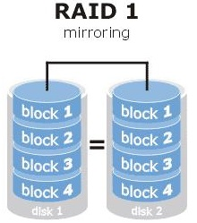
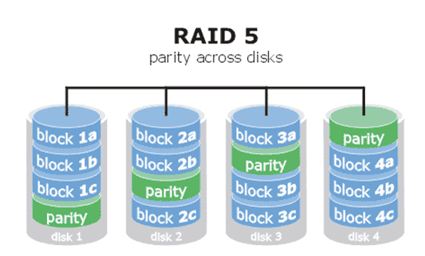
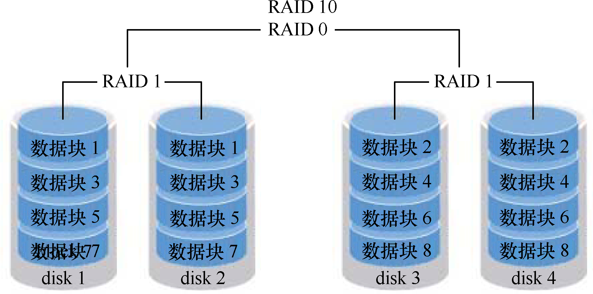

<!--
 * @Author: jangrui
 * @Date: 2019-07-31 05:25:49
 * @LastEditors: jangrui
 * @LastEditTime: 2019-08-22 19:56:40
 * @version: 
 * @Descripttion: RAID
 -->
 
# RAID 磁盘冗余阵列

## 什么是 RAID

RAID全称是独立磁盘冗余阵列（Redundant Array of Independent Disks），基本思想是把多个磁盘组合起来，组合一个磁盘阵列组，使得性能大幅提高。

最常用的四种RAID为 RAID 0、RAID 1、RAID 5、RAID 10。

## RAID 实现方式

- 外接式磁盘阵列：通过扩展卡提供适配能力
- 内接式RAID：主板集成RAID控制器安装OS前在BIOS里配置
- 软件RAID：通过OS实现

## 标准 RAID

### RAID 0

RAID 0技术把多块物理硬盘设备（至少两块）通过硬件或软件的方式串联在一起，组成一个大的卷组，并将数据依次写入到各个物理硬盘中。这样一来，在最理想的状态下，硬盘设备的读写性能会提升数倍，但是若任意一块硬盘发生故障将导致整个系统的数据都受到破坏。通俗来说，RAID 0技术能够有效地提升硬盘数据的吞吐速度，但是不具备数据备份和错误修复能力。数据被分别写入到不同的硬盘设备中，即disk1和disk2硬盘设备会分别保存数据资料，最终实现提升读取、写入速度的效果。


### RAID 1

尽管RAID 0技术提升了硬盘设备的读写速度，但是它是将数据依次写入到各个物理硬盘中，也就是说，它的数据是分开存放的，其中任何一块硬盘发生故障都会损坏整个系统的数据。因此，如果生产环境对硬盘设备的读写速度没有要求，而是希望增加数据的安全性时，就需要用到RAID 1技术了。

RAID 1技术示意图中可以看到，它是把两块以上的硬盘设备进行绑定，在写入数据时，是将数据同时写入到多块硬盘设备上（可以将其视为数据的镜像或备份）。当其中某一块硬盘发生故障后，一般会立即自动以热交换的方式来恢复数据的正常使用。



RAID 1技术虽然十分注重数据的安全性，但是因为是在多块硬盘设备中写入了相同的数据，因此硬盘设备的利用率得以下降，从理论上来说，硬盘空间的真实可用率只有50%，由三块硬盘设备组成的RAID 1磁盘阵列的可用率只有33%左右，以此类推。而且，由于需要把数据同时写入到两块以上的硬盘设备，这无疑也在一定程度上增大了系统计算功能的负载。

那么，有没有一种RAID方案既考虑到了硬盘设备的读写速度和数据安全性，还兼顾了成本问题呢？实际上，单从数据安全和成本问题上来讲，就不可能在保持原有硬盘设备的利用率且还不增加新设备的情况下，能大幅提升数据的安全性。刘遄老师也没有必要忽悠各位读者，下面将要讲解的RAID 5技术虽然在理论上兼顾了三者（读写速度、数据安全性、成本），但实际上更像是对这三者的“相互妥协”。

### RAID 5

RAID5技术是把硬盘设备的数据奇偶校验信息保存到其他硬盘设备中。RAID 5磁盘阵列组中数据的奇偶校验信息并不是单独保存到某一块硬盘设备中，而是存储到除自身以外的其他每一块硬盘设备上，这样的好处是其中任何一设备损坏后不至于出现致命缺陷；parity部分存放的就是数据的奇偶校验信息，换句话说，就是RAID 5技术实际上没有备份硬盘中的真实数据信息，而是当硬盘设备出现问题后通过奇偶校验信息来尝试重建损坏的数据。RAID这样的技术特性“妥协”地兼顾了硬盘设备的读写速度、数据安全性与存储成本问题。



### RAID 10

鉴于RAID 5技术是因为硬盘设备的成本问题对读写速度和数据的安全性能而有了一定的妥协，但是大部分企业更在乎的是数据本身的价值而非硬盘价格，因此生产环境中主要使用RAID 10技术。

顾名思义，RAID 10技术是RAID 1+RAID 0技术的一个“组合体”。RAID 10技术需要至少4块硬盘来组建，其中先分别两两制作成RAID 1磁盘阵列，以保证数据的安全性；然后再对两个RAID 1磁盘阵列实施RAID 0技术，进一步提高硬盘设备的读写速度。这样从理论上来讲，只要坏的不是同一组中的所有硬盘，那么最多可以损坏50%的硬盘设备而不丢失数据。由于RAID 10技术继承了RAID 0的高读写速度和RAID 1的数据安全性，在不考虑成本的情况下RAID 10的性能都超过了RAID 5，因此当前成为广泛使用的一种存储技术。



## 部署磁盘列阵

磁盘准备：

`mdadm` 命令用于管理 Linux 系统中的软件 RAID 硬盘阵列，格式为: `mdadm [模式] <RAID设备名称> [选项] [成员设备名称]`。

mdadm命令的常用参数以及作用：

- -a  检测设备名称
- -n  指定设备数量
- -l  指定RAID级别
- -C  创建
- -v  显示过程
- -f  模拟设备损坏
- -r  移除设备
- -Q  查看摘要信息
- -D  查看详细信息
- -S  停止RAID磁盘阵列

```bash
[root@localhost ~]# ls -l /dev/sd*
brw-rw----. 1 root disk 8,  0 7月  31 06:12 /dev/sda
brw-rw----. 1 root disk 8,  1 7月  31 06:12 /dev/sda1
brw-rw----. 1 root disk 8,  2 7月  31 06:12 /dev/sda2
brw-rw----. 1 root disk 8, 16 7月  31 06:12 /dev/sdb
brw-rw----. 1 root disk 8, 32 7月  31 06:12 /dev/sdc
brw-rw----. 1 root disk 8, 48 7月  31 06:12 /dev/sdd
brw-rw----. 1 root disk 8, 64 7月  31 06:12 /dev/sde
```

以 RAID 10 为例：

> 生产环境中用到的服务器一般都配备RAID阵列卡。

用 sdb-sde 四块硬盘组成 RAID 10 磁盘阵列，名称为 `/dev/md0`。

```bash
[root@localhost ~]# yum install -y mdadm
[root@localhost ~]# mdadm -Cv /dev/md0 -a yes -n 4 -l 10 /dev/sd[b:e]
mdadm: layout defaults to n2
mdadm: layout defaults to n2
mdadm: chunk size defaults to 512K
mdadm: size set to 5237760K
mdadm: Defaulting to version 1.2 metadata
mdadm: array /dev/md0 started.
```

格式化：

```bash
[root@localhost ~]# mkfs.xfs /dev/md0
meta-data=/dev/md0               isize=512    agcount=16, agsize=163712 blks
         =                       sectsz=512   attr=2, projid32bit=1
         =                       crc=1        finobt=0, sparse=0
data     =                       bsize=4096   blocks=2618880, imaxpct=25
         =                       sunit=128    swidth=256 blks
naming   =version 2              bsize=4096   ascii-ci=0 ftype=1
log      =internal log           bsize=4096   blocks=2560, version=2
         =                       sectsz=512   sunit=8 blks, lazy-count=1
realtime =none                   extsz=4096   blocks=0, rtextents=0
```

创建挂载目录：

```bash
[root@localhost ~]# mkdir /raid10
[root@localhost ~]# mount /dev/md0 /raid10
[root@localhost ~]# df -h
文件系统                 容量  已用  可用 已用% 挂载点
/dev/mapper/centos-root  8.0G  1.9G  6.1G   24% /
devtmpfs                 475M     0  475M    0% /dev
tmpfs                    487M     0  487M    0% /dev/shm
tmpfs                    487M  7.5M  479M    2% /run
tmpfs                    487M     0  487M    0% /sys/fs/cgroup
/dev/sda1               1014M  194M  821M   20% /boot
tmpfs                     98M     0   98M    0% /run/user/0
/dev/md0                  10G   33M   10G    1% /raid10
```

查看 `/dev/md0` 详细信息，并使其永久生效：

```bash
[root@localhost ~]# mdadm -D /dev/md0
/dev/md0:
           Version : 1.2
     Creation Time : Wed Jul 31 06:30:37 2019
        Raid Level : raid10
        Array Size : 10475520 (9.99 GiB 10.73 GB)
     Used Dev Size : 5237760 (5.00 GiB 5.36 GB)
      Raid Devices : 4
     Total Devices : 4
       Persistence : Superblock is persistent

       Update Time : Wed Jul 31 06:35:47 2019
             State : clean
    Active Devices : 4
   Working Devices : 4
    Failed Devices : 0
     Spare Devices : 0

            Layout : near=2
        Chunk Size : 512K

Consistency Policy : resync

              Name : localhost.localdomain:0  (local to host localhost.localdomain)
              UUID : 79005a6f:d8ca3e08:05cea84f:de2cff6b
            Events : 17

    Number   Major   Minor   RaidDevice State
       0       8       16        0      active sync set-A   /dev/sdb
       1       8       32        1      active sync set-B   /dev/sdc
       2       8       48        2      active sync set-A   /dev/sdd
       3       8       64        3      active sync set-B   /dev/sde
[root@localhost ~]# cat <<EOF> /etc/fstab
/dev/md0 /raid10 xfs defaults 0 0
EOF
```

## 磁盘阵列损坏及修复

使用 `mdadm` 命令移除损坏设备，检查 RAID 阵列状态。

```bash
[root@localhost ~]# mdadm /dev/md0 -f /dev/sdb
mdadm: set /dev/sdb faulty in /dev/md0
[root@localhost ~]# mdadm -D /dev/md0
/dev/md0:
           Version : 1.2
     Creation Time : Wed Jul 31 06:30:37 2019
        Raid Level : raid10
        Array Size : 10475520 (9.99 GiB 10.73 GB)
     Used Dev Size : 5237760 (5.00 GiB 5.36 GB)
      Raid Devices : 4
     Total Devices : 4
       Persistence : Superblock is persistent

       Update Time : Wed Jul 31 06:49:20 2019
             State : clean, degraded
    Active Devices : 3
   Working Devices : 3
    Failed Devices : 1
     Spare Devices : 0

            Layout : near=2
        Chunk Size : 512K

Consistency Policy : resync

              Name : localhost.localdomain:0  (local to host localhost.localdomain)
              UUID : 79005a6f:d8ca3e08:05cea84f:de2cff6b
            Events : 19

    Number   Major   Minor   RaidDevice State
       -       0        0        0      removed
       1       8       32        1      active sync set-B   /dev/sdc
       2       8       48        2      active sync set-A   /dev/sdd
       3       8       64        3      active sync set-B   /dev/sde

       0       8       16        -      faulty   /dev/sdb
[root@localhost ~]#
```

> 在RAID 10级别的磁盘阵列中，当RAID 1磁盘阵列中存在一个故障盘时并不影响RAID 10磁盘阵列的使用。添加新硬盘设备后再使用mdadm命令来予以替换即可。

替换新硬盘：

```bash
[root@localhost ~]# umount /dev/md0
[root@localhost ~]# mdadm /dev/md0 -a /dev/sdf
mdadm: added /dev/sdf
[root@localhost ~]# mdadm /dev/md0 -r /dev/sdb
mdadm: hot removed /dev/sdb from /dev/md0
[root@localhost ~]# mdadm -D /dev/md0
/dev/md0:
           Version : 1.2
     Creation Time : Wed Jul 31 06:30:37 2019
        Raid Level : raid10
        Array Size : 10475520 (9.99 GiB 10.73 GB)
     Used Dev Size : 5237760 (5.00 GiB 5.36 GB)
      Raid Devices : 4
     Total Devices : 4
       Persistence : Superblock is persistent

       Update Time : Wed Jul 31 06:59:30 2019
             State : clean
    Active Devices : 4
   Working Devices : 4
    Failed Devices : 0
     Spare Devices : 0

            Layout : near=2
        Chunk Size : 512K

Consistency Policy : resync

              Name : localhost.localdomain:0  (local to host localhost.localdomain)
              UUID : 79005a6f:d8ca3e08:05cea84f:de2cff6b
            Events : 74

    Number   Major   Minor   RaidDevice State
       5       8       80        0      active sync set-A   /dev/sdf
       1       8       32        1      active sync set-B   /dev/sdc
       2       8       48        2      active sync set-A   /dev/sdd
       3       8       64        3      active sync set-B   /dev/sde
[root@localhost ~]#
```

## 磁盘阵列+备份盘

使用RAID备份盘技术可以预防某块硬盘出现故障时自动顶替，从而保障正常工作，不至于丢掉饭碗。

该技术的核心理念就是准备一块足够大的硬盘，这块硬盘平时处于闲置状态，一旦RAID磁盘阵列中有硬盘出现故障后则会马上自动顶替上去。

添加备份硬盘并模拟硬盘损坏后自动替换：

```bash
mdadm /dev/md0 -a /dev/sdb
[root@localhost ~]# mdadm -D /dev/md0
/dev/md0:
           Version : 1.2
     Creation Time : Wed Jul 31 06:30:37 2019
        Raid Level : raid10
        Array Size : 10475520 (9.99 GiB 10.73 GB)
     Used Dev Size : 5237760 (5.00 GiB 5.36 GB)
      Raid Devices : 4
     Total Devices : 5
       Persistence : Superblock is persistent

       Update Time : Wed Jul 31 07:23:57 2019
             State : clean
    Active Devices : 4
   Working Devices : 5
    Failed Devices : 0
     Spare Devices : 1

            Layout : near=2
        Chunk Size : 512K

Consistency Policy : resync

              Name : localhost.localdomain:0  (local to host localhost.localdomain)
              UUID : 79005a6f:d8ca3e08:05cea84f:de2cff6b
            Events : 228

    Number   Major   Minor   RaidDevice State
       6       8       32        0      active sync set-A   /dev/sdf
       8       8       64        1      active sync set-B   /dev/sdc
       5       8       80        2      active sync set-A   /dev/sdd
       7       8       48        3      active sync set-B   /dev/sde

       4       8       16        -      spare   /dev/sdb
[root@localhost ~]# mdadm /dev/md0 -f /dev/sdc
mdadm: set /dev/sdc faulty in /dev/md0
[root@localhost ~]# mdadm -D /dev/md0
/dev/md0:
           Version : 1.2
     Creation Time : Wed Jul 31 06:30:37 2019
        Raid Level : raid10
        Array Size : 10475520 (9.99 GiB 10.73 GB)
     Used Dev Size : 5237760 (5.00 GiB 5.36 GB)
      Raid Devices : 4
     Total Devices : 5
       Persistence : Superblock is persistent

       Update Time : Wed Jul 31 07:26:56 2019
             State : clean, degraded, recovering
    Active Devices : 3
   Working Devices : 4
    Failed Devices : 1
     Spare Devices : 1

            Layout : near=2
        Chunk Size : 512K

Consistency Policy : resync

    Rebuild Status : 8% complete

              Name : localhost.localdomain:0  (local to host localhost.localdomain)
              UUID : 79005a6f:d8ca3e08:05cea84f:de2cff6b
            Events : 252

    Number   Major   Minor   RaidDevice State
       5       8       80        0      spare rebuilding   /dev/sdb
       8       8       64        1      active sync set-B   /dev/sdf
       4       8       16        2      active sync set-A   /dev/sdd
       7       8       48        3      active sync set-B   /dev/sde

       6       8       32        -      faulty   /dev/sdc
```

可以看到 `Rebuild Status : 8% complete` 正在自动同步。

同步完后：

```bash
[root@localhost ~]# mdadm -D /dev/md0
/dev/md0:
           Version : 1.2
     Creation Time : Wed Jul 31 06:30:37 2019
        Raid Level : raid10
        Array Size : 10475520 (9.99 GiB 10.73 GB)
     Used Dev Size : 5237760 (5.00 GiB 5.36 GB)
      Raid Devices : 4
     Total Devices : 5
       Persistence : Superblock is persistent

       Update Time : Wed Jul 31 07:27:20 2019
             State : clean
    Active Devices : 4
   Working Devices : 4
    Failed Devices : 1
     Spare Devices : 0

            Layout : near=2
        Chunk Size : 512K

Consistency Policy : resync

              Name : localhost.localdomain:0  (local to host localhost.localdomain)
              UUID : 79005a6f:d8ca3e08:05cea84f:de2cff6b
            Events : 268

    Number   Major   Minor   RaidDevice State
       5       8       80        0      active sync set-A   /dev/sdb
       8       8       64        1      active sync set-B   /dev/sdf
       4       8       16        2      active sync set-A   /dev/sdd
       7       8       48        3      active sync set-B   /dev/sde

       6       8       32        -      faulty   /dev/sdc
[root@localhost ~]#
```

创建 RAID 阵列时添加备份硬盘：

```bash
[root@localhost ~]# mdadm -S /dev/md0
mdadm: stopped /dev/md0
[root@localhost ~]# mdadm -Cv /dev/md10 -n4 -x 1 -l 10 /dev/sd[b-f]
mdadm: layout defaults to n2
mdadm: layout defaults to n2
mdadm: chunk size defaults to 512K
mdadm: /dev/sdb appears to be part of a raid array:
       level=raid10 devices=4 ctime=Wed Jul 31 07:39:17 2019
mdadm: /dev/sdc appears to be part of a raid array:
       level=raid10 devices=4 ctime=Wed Jul 31 07:39:17 2019
mdadm: /dev/sdd appears to be part of a raid array:
       level=raid10 devices=4 ctime=Wed Jul 31 07:39:17 2019
mdadm: /dev/sde appears to be part of a raid array:
       level=raid10 devices=4 ctime=Wed Jul 31 07:39:17 2019
mdadm: /dev/sdf appears to be part of a raid array:
       level=raid10 devices=4 ctime=Wed Jul 31 07:39:17 2019
mdadm: size set to 5237760K
Continue creating array? y
mdadm: Defaulting to version 1.2 metadata
mdadm: array /dev/md10 started.
[root@localhost ~]# mdadm -D /dev/md10
/dev/md10:
           Version : 1.2
     Creation Time : Wed Jul 31 07:41:59 2019
        Raid Level : raid10
        Array Size : 10475520 (9.99 GiB 10.73 GB)
     Used Dev Size : 5237760 (5.00 GiB 5.36 GB)
      Raid Devices : 4
     Total Devices : 5
       Persistence : Superblock is persistent

       Update Time : Wed Jul 31 07:42:28 2019
             State : clean, resyncing
    Active Devices : 4
   Working Devices : 5
    Failed Devices : 0
     Spare Devices : 1

            Layout : near=2
        Chunk Size : 512K

Consistency Policy : resync

     Resync Status : 59% complete

              Name : localhost.localdomain:10  (local to host localhost.localdomain)
              UUID : e256bfe1:a59ef9d6:90f5da16:4cfe0ca3
            Events : 9

    Number   Major   Minor   RaidDevice State
       0       8       16        0      active sync set-A   /dev/sdb
       1       8       32        1      active sync set-B   /dev/sdc
       2       8       48        2      active sync set-A   /dev/sdd
       3       8       64        3      active sync set-B   /dev/sde

       4       8       80        -      spare   /dev/sdf
[root@localhost ~]#
```

## 解散阵列

```bash
[root@localhost ~]# mdadm -S /dev/md10
mdadm: stopped /dev/md10
[root@localhost ~]# ls -al /dev/md10
ls: 无法访问/dev/md10: 没有那个文件或目录
```
