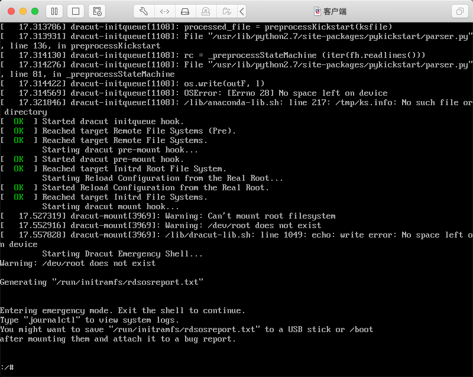

<!--
 * @Author: jangrui
 * @Date: 2019-07-31 07:48:42
 * @LastEditors: jangrui
 * @LastEditTime: 2019-08-28 07:46:03
 * @version: 
 * @Descripttion: 
 -->

# PXE + Kickstart 部署无人值守安装服务

## PXE 简介

PXE 不是一种安装方式，是一种引导的方式。
 
PXE 引导方式要求安装的计算机中必须包含一个 支持 PXE 的网卡，且主板支持网络引导，PXE（Pre-boot Execution Environment）协议使计算机可以通过网络启动。 
 
PXE 协议分为 client 和 server 端，PXE client 在网卡 Rom 中，当计算机引导时，cpu 通过加载 bios 映射到内存中的片段，然后检查计算机的健康状况（如cpu风扇，网卡等）继而 把网卡 Rom 中的 PXE client 调入内存引导执行，由 PXE client 将放置在远端的文件通过网络下载到本地运行。
 
PXE 协议需要 DHCP 服务 和 TFTP/MTFTP 服务配合使用。

DHCP 服务器用来给 PXE client 分配一个 IP 地址，由于是给 PXE client 分配 IP 地址，所以在配置 DHCP 服务器时需要增加相应的设置。

PXE Client 通过 TFTP 协议到 TFTP Server 上下载所需的文件。在 PXE client 的 ROM 中，已经存在了 TFTP Client。

## Kickstart 简介

kickstart 是一个利用 Anconda 工具实现服务器自动化安装的方法；通过生成的 kickstart 配置文件 ks.cfg，服务器安装可以实现从裸机到全功能服务的的非交互式（无人值守式）安装配置。

整体安装思路：

- `dhcp`: 提供客户端 ip 自动分配
- `tftp`: 提供引导文件传输
- `syslinux`: 提供引导文件
- `httpd`: 提供镜像文件传输
- `kickstart`: 实现自动安装

## DHCP 服务

> 服务端主机 ip：192.168.10.10

```bash
yum install -y dhcp
systemctl start dhcpd
systemctl enable dhcpd

cat <<EOF> /etc/dhcp/dhcpd.conf
allow booting;
allow bootp;
ddns-update-style interim;
ignore client-updates;
subnet 192.168.10.0 netmask 255.255.255.0 {
    option subnet-mask  255.255.255.0;
    option domain-name-servers  192.168.10.10;
    range dynamic-bootp 192.168.10.100  192.168.10.200;
    default-lease-time  21600;
    max-lease-time      43200;
    next-server         192.168.10.10;
    filename            "pxelinux.0";
}
EOF

systemctl restart dhcpd
firewall-cmd --permanent --add-service=dhcp
firewall-cmd --reload
```

## TFTP 服务

```bash
yum install -y tftp-server xinetd
systemctl start xinetd
systemctl enable xinetd
firewall-cmd --permanent --add-service=tftp
firewall-cmd --reload

sed -i 's,disable.*,disable \t\t= no,' /etc/xinetd.d/tftp

systemctl restart xinetd tftp
```

## SYSLinux 服务

SYSLinux 是一个用于提供引导加载的服务程序。与其说 SYSLinux 是一个服务程序，不如说更需要里面的引导文件，在安装好 SYSLinux 服务程序软件包后，`/usr/share/syslinux` 目录中有很多引导文件。

首先需要把 SYSLinux 提供的引导文件复制到 TFTP 服务程序的默认目录中，也就是 `pxelinux.0` 文件，这样客户端主机就能够顺利地获取到引导文件了。另外在常见 linux 系统发行版光盘镜像中也有一些我们需要调取的引导文件。

> centos 7：

```bash
yum install -y syslinux

mkdir /media/cdrom /var/lib/tftpboot/pxelinux.cfg
mount /dev/cdrom /media/cdrom

/usr/bin/cp -r /usr/share/syslinux/pxelinux.0 /var/lib/tftpboot
/usr/bin/cp -r /media/cdrom/images/pxeboot/{vmlinuz,initrd.img} /var/lib/tftpboot
/usr/bin/cp -r /media/cdrom/isolinux/{vesamenu.c32,boot.msg} /var/lib/tftpboot
/usr/bin/cp -r /media/cdrom/isolinux/isolinux.cfg /var/lib/tftpboot/pxelinux.cfg/default

sed -i '/label linux/i\label linux by kickstart' /var/lib/tftpboot/pxelinux.cfg/default
sed -i '/kickstart/a\  append initrd=initrd.img inst.ks=http:\/\/192.168.10.10\/ks.cfg' /var/lib/tftpboot/pxelinux.cfg/default
sed -i '/kickstart/a\  kernel vmlinuz' /var/lib/tftpboot/pxelinux.cfg/default
sed -i '/kickstart/a\  menu label ^Install CentOS 7 By Kickstart' /var/lib/tftpboot/pxelinux.cfg/default
```

## httpd 服务

httpd 服务用来提供 linux 系统发行版镜像以 web 访问方式传输。

> httpd 服务可用 ftp、tftp、nfs 服务代替。

```bash
yum install -y httpd
systemctl enable httpd
systemctl start httpd
firewall-cmd --permanent --add-service=http
firewall-cmd --reload

mkdir /var/www/html/centos7
mount --bind /media/cdrom /var/www/html/centos7
```

## Kickstart 应答文件

> system-config-kickstart 一款图形化 Kickstart 应答文件生成工具。

```bash
cat <<EOF> /var/www/html/ks.cfg
auth --enableshadow --passalgo=sha512
url --url="http://192.168.10.10/centos7"
graphical
firstboot --enable
ignoredisk --only-use=sda
keyboard --vckeymap=cn --xlayouts='cn'
lang zh_CN.UTF-8

network  --bootproto=dhcp --device=ens32 --ipv6=auto --activate
network  --hostname=localhost.localdomain

rootpw --iscrypted $6$1FGZRaMsWbxtVX36$izfoLF3TuXDFkYJoFTd2.c1NGSn5gfydIr.PthlqRkuhbdIgODB4esi3QatJTxpFm8ChMgJ3qn029UT25Q1t0.
services --disabled="chronyd"
timezone Asia/Shanghai --isUtc --nontp
bootloader --location=mbr --boot-drive=sda
autopart --type=lvm
clearpart --all --initlabel

%packages --ignoremissing --multilib
@^minimal
@development-tools
@core
net-tools
wget
vim
git
%end

install
reboot
EOF
```

> 参考：https://access.redhat.com/documentation/zh-cn/red_hat_enterprise_linux/7/html/installation_guide/sect-kickstart-syntax
>
> sha512 加密：`python -c 'import crypt; print(crypt.crypt("My Password"))'`

## 客户端

> 虚拟机模拟环境：新建 `自定义虚拟机` >> `Linux` >> `Centos7 64位` >> `自定义设置` >> `网络模式与服务端相同`

正常获取获取 ks 文件之后，若正常进入自动安装界面，等待系统安装完成即可。

### 问题

- 客户端内存不足



`解决方法`：客户端增加足够内存。

> 参考：https://github.com/cobbler/cobbler/issues/1477

- 重启再次进入 PXE 引导模式

物理机应设置网络引导在硬盘引导之后。
