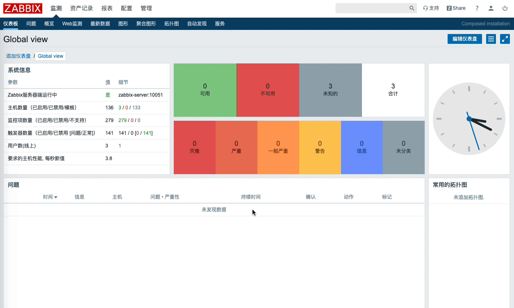
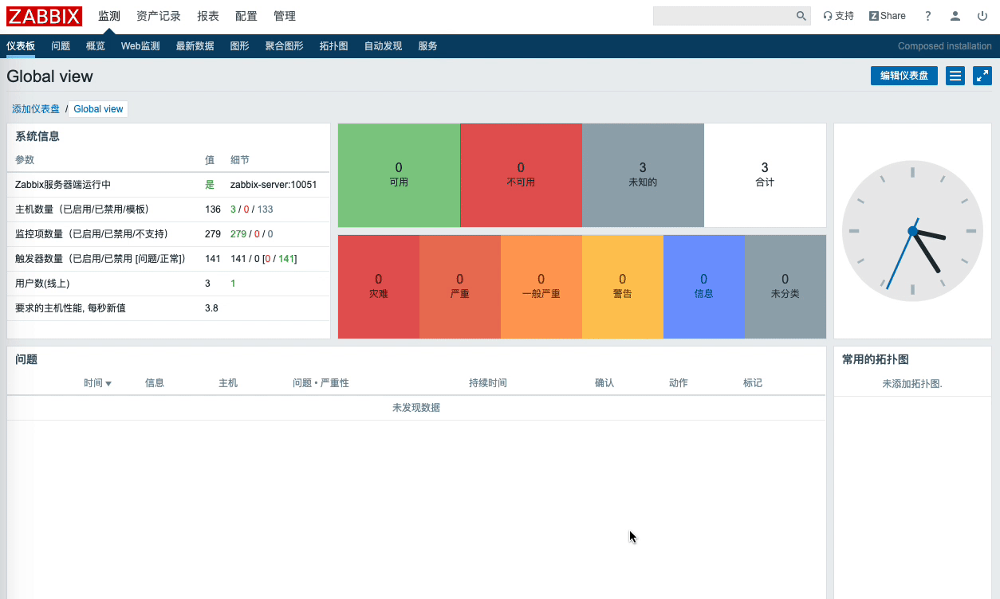

# Zabbix 添加钉钉告警

## 准备

- 钉钉部门群添加自定义机器人
- 获取自定义机器人 webhook 地址

> 钉钉网页版：https://im.dingtalk.com/

## Zabbix Server 配置

- 脚本目录

```bash
[root@localhost]# grep alertscripts /etc/zabbix/zabbix_server.conf
AlertScriptsPath=/usr/lib/zabbix/alertscripts
```

- 脚本内容

```bash
[root@localhost]# cat /usr/lib/zabbix/alertscripts/dingding.sh
#!/bin/bash
# Auther: https://notes.jangrui.com/#/zabbix/dingding
# update time: 2019-12.19
# description: 钉钉部门自定义机器人报警脚本

dingding() {
    curl "$SendUrl" -H 'Content-Type: application/json' -d '{
        "msgtype": "text",
        "text": {
            "content": "'"$Subject \n$Message"'"
        },
        "at":{
        "atMobiles": [ "'"$Sendto"'" ],
        "isAtAll": false
        }
    }'

    time=`date +"%Y-%m-%d"`
    echo -e "`date` \n接收用户: $Sendto \n$Subject \n$Message \n" >> /var/log/zabbix/zbx_dingding-$time.log
}

# zabbix 告警媒介脚本参数 1
Sendto=$1
# zabbix 告警媒介脚本参数 2
Subject=$2
# zabbix 告警媒介脚本参数 3
Message=$3
# zabbix 告警媒介脚本参数 4 && 钉钉部门自定义机器人 webhook
SendUrl=$4

if [[ $# != 4 ]]; then
    echo "Usage: $0 Sendto Subject Message SendUrl"
    return 1
fi

dingding
```

- 脚本测试

```bash
/usr/lib/zabbix/alertscripts/dingding.sh name subject "This is message" webhook_url
```

## Zabbix Web 配置

- 添加报警媒介类型


> 脚本参数：
> - {ALERT.SENDTO}
> - {ALERT.SUBJECT}
> - {ALERT.MESSAGE}
> - 钉钉部门群自定义机器人 webhook

- 添加用户报警媒介



- 添加报警动作


