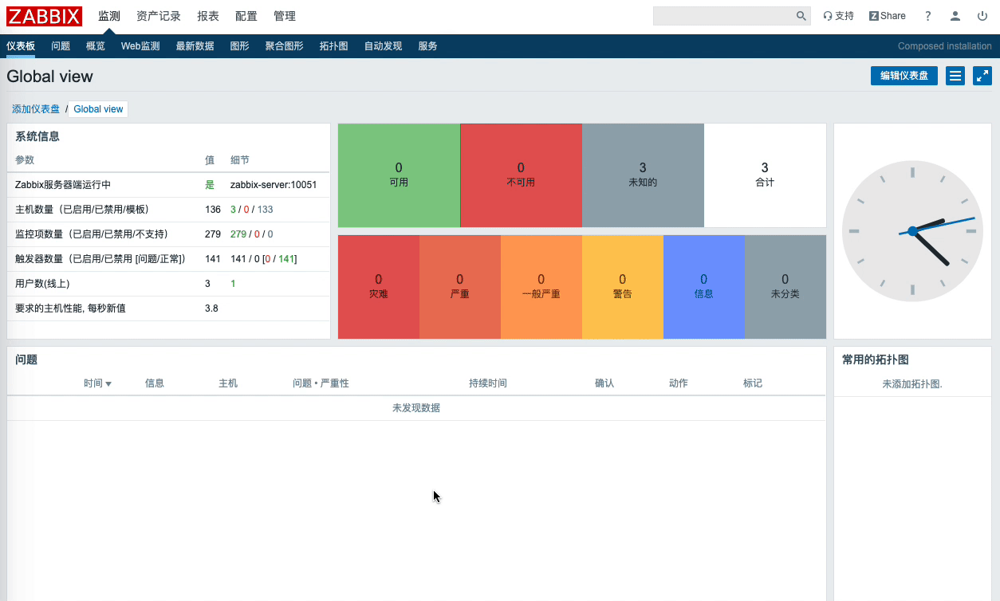

# Zabbix 添加企业微信告警

## 准备

- 注册企业微信：获取**企业 ID**
- 创建部门：获取**部门 ID**
- 企业微信添加自建应用：获取**AgentId**、**Secret**、

> 企业微信：https://work.weixin.qq.com/

## Zabbix Server 配置

- 脚本目录

```bash
[root@localhost]# grep alertscripts /etc/zabbix/zabbix_server.conf
AlertScriptsPath=/usr/lib/zabbix/alertscripts
```

- 脚本内容

```bash
[root@localhost]# cat /usr/lib/zabbix/alertscripts/wechat.sh
#!/bin/bash
# Auther: https://notes.jangrui.com/#/zabbix/wechat
# update time: 2019-12.19
# description: 企业微信自定义应用报警脚本

wechat(){
    curl "$SendUrl" -H 'Content-Type: application/json' -d '{
        "touser": "'"$Sendto"'",
        "toparty": "'"$PartyId"'",
        "msgtype": "text",
        "agentid": "'"$AgentId"'",
        "text": {
            "content": "'"$Subject\n$Message"'"
        },
        "safe": 0
    }'

    time=`date +"%Y-%m-%d"`
    echo -e "`date` \n接收用户: $Sendto \n$Subject \n$Message \n" >> /var/log/zabbix/zbx_dingding-$time.log
}

# 企业微信部门 id && zabbix 参数 7
Sendto=$1
# zabbix 参数 2
Subject=$2
# zabbix 参数 3
Message=$3
# 企业微信 CropID && zabbix 参数 4
CropID=$4
# 企业微信应用 id && zabbix 参数 6
AgentId=$5
# 企业微信 CropID && zabbix 参数 5
Secret=$6
# 企业微信部门 id && zabbix 参数 7
PartyId=$7

TokenUrl="https://qyapi.weixin.qq.com/cgi-bin/gettoken?corpid=$CropID&corpsecret=$Secret" 
Token=$(/usr/bin/curl -s -G $TokenUrl | awk -F \" '{print $10}')
SendUrl="https://qyapi.weixin.qq.com/cgi-bin/message/send?access_token=$Token"

if [[ $# != 4 ]]; then
    echo "Usage: $0 Sendto Subject Message CropID Secret AgentId PartyId"
    return 1
fi

wechat
```

- 脚本测试

```bash
/usr/lib/zabbix/alertscripts/wechat.sh name subject "This's message" CropID AgentId Secret PartyId
```

## Zabbix Web 配置

- 添加报警媒介类型


> 脚本参数：
> - {ALERT.SENDTO}
> - {ALERT.SUBJECT}
> - {ALERT.MESSAGE}
> - 企业微信 ID
> - 企业微信自建应用 AgentId
> - 企业微信自建应用 Secret
> - 企业微信部门 ID

- 添加用户报警媒介



- 添加报警动作


